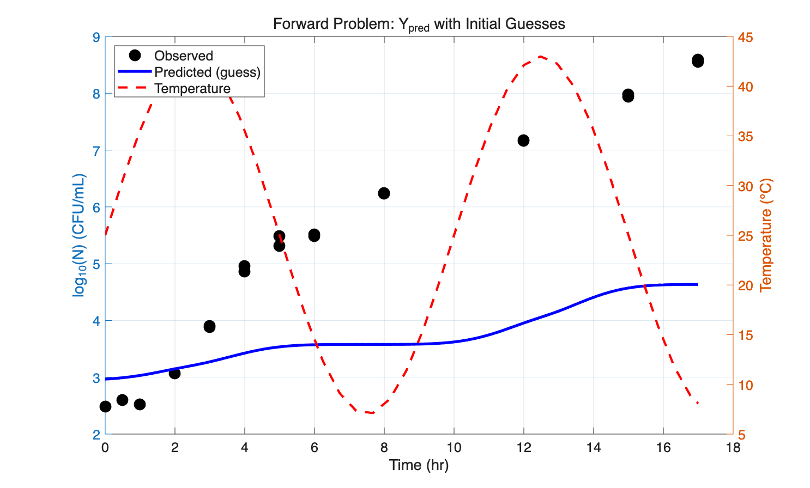
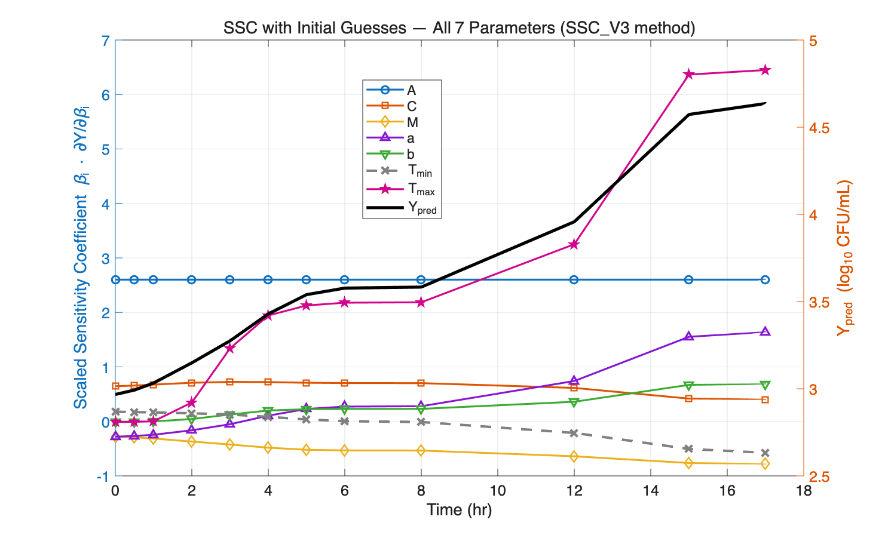
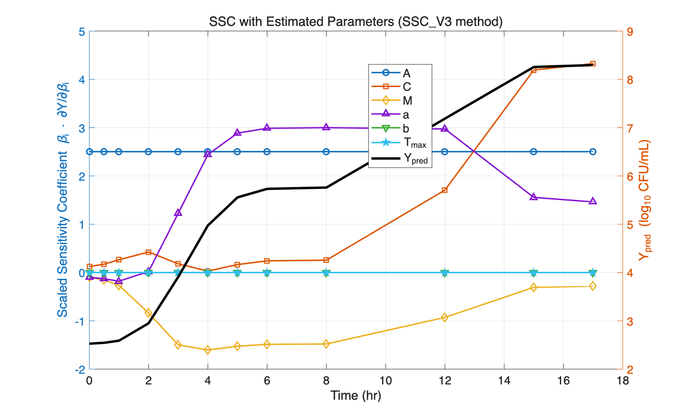

# Forward Problem — 作业回答

> 课程：生物系统工程分析方法与实践  
> 项目：蛋黄中肠炎沙门氏菌（*Salmonella* Enteritidis）变温动态生长预测模型  
> 参考文献：Gumudavelli V, Subbiah J, Thippareddi H, Velugoti PR, Froning G. 2007. *Dynamic model for predicting growth of Salmonella spp. in egg yolk.* J. Food Sci. 72: M254–62.

---

## Question 1：选择非线性模型

### 模型来源

本项目的模型取自文献 **Gumudavelli et al. (2007)**，属于 **"Good/Better" 级别**（来自论文的模型，且与食品安全/微生物预测建模研究相关）。

### 模型描述

本项目采用 **两级动态生长预测模型**，由一级模型（描述菌落生长动力学）和二级模型（描述温度对生长速率的影响）耦合而成，通过 ODE 数值求解实现变温条件下的动态预测。

#### 一级模型：Gompertz 微分形式（ODE）

恒温条件下 Gompertz 模型的解析式为：

$$\log_{10} N(t) = A + C \cdot \exp\left(-\exp\left(\frac{\mu \cdot e}{C}(M - t) + 1\right)\right)$$

对应的微分形式（用于变温 ODE 求解）为：

$$\frac{dy}{dt} = -\mu(T) \cdot e \cdot \frac{y - A}{C} \cdot \ln\left(\frac{y - A}{C}\right)$$

其中 $y = \log_{10} N$（菌落对数浓度，CFU/mL）。

#### 二级模型：修正 Ratkowsky 方程（显式代数方程）

$$\mu(T) = a \cdot (T - T_{\min})^2 \cdot \left(1 - \exp\left(b \cdot (T - T_{\max})\right)\right)$$

该方程描述瞬时最大比生长速率 $\mu$ 随温度 $T$ 的变化关系。

#### 耦合方式

在每个 ODE 求解步中：
1. 通过 `interp1` 线性插值获取当前时刻的温度 $T(t)$
2. 代入 Ratkowsky 方程计算 $\mu(T)$
3. 再代入 Gompertz ODE 计算 $dy/dt$
4. 使用 MATLAB `ode45`（4/5 阶 Runge-Kutta 法）数值积分

### 参数总数

模型共有 **7 个参数**，其中 **5 个待估计**，**2 个固定**，满足"至少 2 个参数"的要求。

| 参数 | 含义 | 类型 |
|------|------|------|
| $A$ | 初始菌量 $\log_{10}$(CFU/mL) | 待估计 |
| $C$ | 增长幅度（上下渐近线之差） | 待估计 |
| $M$ | 拐点时间 (hr) | 待估计 |
| $a$ | Ratkowsky 回归系数 (°C⁻²) | 待估计 |
| $b$ | Ratkowsky 回归系数 (°C⁻¹) | 待估计 |
| $T_{\min}$ | 理论最低生长温度 (°C) | **固定** = 6.0 |
| $T_{\max}$ | 理论最高生长温度 (°C) | **固定** = 46.3 |

---

## Question 2：参数初始猜测值的合理性

### 初始猜测值

| 参数 | 初始猜测值 | 猜测依据 |
|------|-----------|---------|
| $A$ | $\log_{10}(400) \approx 2.60$ | 初始接种量约 400 CFU/mL，取对数 |
| $C$ | 11.0 | 文献报道蛋黄中 SE 可增长约 11 个数量级（从 ~$10^{2.6}$ 到 ~$10^{13.6}$）|
| $M$ | 7.5 hr | 预计指数增长拐点出现在实验中段 |
| $a$ | 0.000338 °C⁻² | 来自文献 Ratkowsky 方程回归值 |
| $b$ | 0.275 °C⁻¹ | 来自文献 Ratkowsky 方程回归值 |
| $T_{\min}$ | 6.0 °C（固定） | 文献报道沙门氏菌理论最低生长温度 |
| $T_{\max}$ | 46.3 °C（固定） | 文献报道沙门氏菌理论最高生长温度 |

### 猜测依据说明

- **$A$**：根据实验设计的初始接种量直接计算
- **$C$**：基于文献中蛋黄培养基上 SE 在最适温度下的最大生长潜力
- **$M$**：根据典型 S 形曲线特征，在 17 小时实验中拐点大致在 7–8 小时
- **$a$ 和 $b$**：直接引用 Gumudavelli et al. (2007) 文献中的 Ratkowsky 模型回归系数
- **$T_{\min}$ 和 $T_{\max}$**：取自文献公认值，固定不估计（SSC 分析证实在单温度曲线下不可估计）

---

## Question 3：正向问题 — 用初始猜测值预测 $Y$

### 方法

使用初始猜测参数 $\beta_0 = [A_0, C_0, M_0, a_0, b_0] = [2.60, 11, 7.5, 0.000338, 0.275]$，通过 `ode45` 求解 Gompertz ODE，得到预测曲线 $Y_{\text{pred}}$，并与实验观测数据对比。

### 实验数据概况

- **菌落数据**：正弦温度曲线（~7–43°C）下 0–17 小时共 12 个时间点，20 个观测值
  - 0, 0.5, 1, 2 hr：单次测量
  - 3, 5, 7, 9, 11, 13, 15, 17 hr：双重复测量
- **温度数据**：47 个数据点，正弦波形 ~7.1–43.0°C，24 小时周期

### 正向预测图

### 分析

从图中可以看出：

1. **趋势一致**：初始猜测参数产生的预测曲线捕捉了数据的整体 S 形增长趋势
2. **增长幅度偏大**：猜测值 $C = 11$ 使得预测的最终菌量明显高于实际观测（最终估计 $C \approx 6.38$），说明初始猜测偏乐观
3. **拐点位置偏后**：猜测值 $M = 7.5$ hr 使得曲线的快速增长阶段出现较晚（最终估计 $M \approx 2.92$ hr），实际上细菌进入指数增长期比预期更早
4. **参数合理接近**：尽管存在偏差，预测曲线与数据在同一数量级范围内，能够为非线性最小二乘优化（`nlinfit`）提供合理的收敛起点

### 最终估计结果（供对比）

优化后模型拟合非常好：

| 指标 | 值 |
|------|-----|
| RMSE | 0.2524 $\log_{10}$ CFU/mL |
| Pseudo-$R^2$ | 0.9874 |

| 参数 | 初始猜测 | 最终估计 | 相对误差 (%) | 95% 置信区间 |
|------|---------|---------|-------------|-------------|
| $A$ | 2.602 | 2.401 | 10.58% | [1.860, 2.943] |
| $C$ | 11.000 | 6.380 | 7.16% | [5.407, 7.353] |
| $M$ | 7.500 | 2.921 | 61.87% | [−0.931, 6.774] |
| $a$ | 0.000338 | 0.001135 | 23.15% | [0.000575, 0.001695] |
| $b$ | 0.275 | 0.262 | 83.20% | [−0.203, 0.727] |

---

## Question 4：缩放灵敏度系数 (SSC) 分析

### 计算方法

缩放灵敏度系数（Scaled Sensitivity Coefficient, SSC）通过 **前向有限差分法** 计算：

$$\text{SSC}_{ij} = p_j \cdot \frac{\partial y_i}{\partial p_j} \approx p_j \cdot \frac{y_i(p_j + \Delta p_j) - y_i(p_j)}{\Delta p_j}$$

其中扰动量 $\Delta p_j = \max(|p_j| \times 10^{-4},\ 10^{-10})$。

每次仅扰动一个参数，重新求解完整 ODE，逐一计算各参数的 SSC。

### SSC 图（初始猜测参数）

图中**左 y 轴**为各参数的 SSC 曲线，**右 y 轴**为模型预测值 $Y_{\text{pred}}$（初始猜测参数下的 $\log_{10} N$）。图中同时包含了 **全部 7 个参数**（含固定参数 $T_{\min}$ 和 $T_{\max}$），可以直观看到 $T_{\min}$、$T_{\max}$ 的 SSC 几乎为零，证明它们不可估计。

#### 初始 SSC 最大绝对值

| 参数 | max|SSC| | 可估计？ |
|------|---------|---------|
| $A$ | 2.6021 | ✅ 是 |
| $C$ | 0.7245 | ✅ 是 |
| $M$ | 0.7740 | ✅ 是 |
| $a$ | 1.6354 | ✅ 是 |
| $b$ | 0.6803 | ✅ 是 |
| $T_{\min}$ | ≈ 0 | ❌ 否 → 固定 |
| $T_{\max}$ | ≈ 0 | ❌ 否 → 固定 |

### SSC 图（最终估计参数）

图中**左 y 轴**为各参数的 SSC 曲线，**右 y 轴**为模型预测值 $Y_{\text{pred}}$（最终估计参数下的 $\log_{10} N$）。

#### 最终 SSC 最大绝对值

| 参数 | max|SSC| |
|------|---------|
| $A$ | 2.4649 |
| $C$ | **4.2172** |
| $M$ | 1.1521 |
| $a$ | **3.0349** |
| $b$ | 1.3092 |

### (a) 哪些参数可以被估计？为什么？

**5 个参数（$A, C, M, a, b$）可以被估计，2 个参数（$T_{\min}, T_{\max}$）不可估计。**

**可估计的判断依据：**

1. **SSC 幅值显著不为零**：5 个待估参数的 SSC 最大绝对值均远大于零（从 0.68 到 2.60），说明模型输出对每个参数都有足够的灵敏度，数据中包含了估计这些参数所需的信息。

2. **SSC 模式互不相同**：从 SSC 图中可以看到，5 个参数的灵敏度曲线在不同时间段呈现出不同的形状和方向：
   - $A$ 的 SSC 在早期（t < 5 hr）最为显著，之后趋于零
   - $C$ 的 SSC 在后期（t > 7 hr）持续增大
   - $M$ 和 $a$ 的 SSC 在中段达到峰值
   - $b$ 的 SSC 变化相对平缓
   
   **这种不同的时间模式意味着参数之间具有良好的可辨识性**——不存在某两个参数的 SSC 曲线完全成比例（线性相关）的情况，因此最小二乘估计能够将各参数的影响区分开来。

3. **$T_{\min}$ 和 $T_{\max}$ 不可估计**：从初始 SSC 图中可以直观看到，$T_{\min}$ 和 $T_{\max}$ 的 SSC 曲线（灰色虚线）紧贴零线，max|SSC| ≈ 0。这意味着模型输出对这两个参数的变化几乎不敏感——在单一正弦温度曲线下，微小改变 $T_{\min}$ 或 $T_{\max}$ 对菌落生长预测的影响可以忽略不计。因此它们无法被可靠估计，必须固定为文献值。

### (b) 参数估计精度排序（从高到低）

基于 **最终 SSC 最大绝对值** 和 **参数估计的相对误差**，参数估计精度排序如下：

| 精度排名 | 参数 | max|SSC| | 相对误差 (%) | 理由 |
|---------|------|---------|------------|------|
| **1（最精确）** | $C$ | 4.2172 | 7.16% | SSC 最大，说明数据对 $C$ 最灵敏；相对误差最小 |
| **2** | $A$ | 2.4649 | 10.58% | SSC 次大；初始阶段灵敏度高 |
| **3** | $a$ | 3.0349 | 23.15% | SSC 较大但与 $b$ 高度相关（$r = -0.930$），降低了精度 |
| **4** | $M$ | 1.1521 | 61.87% | SSC 中等；与 $A$（$r = 0.808$）和 $b$（$r = 0.826$）均有高相关性 |
| **5（最不精确）** | $b$ | 1.3092 | 83.20% | SSC 最小之一；与 $a$ 高度相关（$r = -0.930$），95% CI 包含零 |

#### 关键发现

- **$C$（增长幅度）估计最精确**：因为晚期数据点直接约束了最终菌量，SSC 在 t > 7 hr 持续增大且幅值最高。
- **$b$（Ratkowsky 系数）估计最不精确**：其 95% 置信区间 $[-0.203, 0.727]$ 包含零，且与 $a$ 的相关性高达 $-0.930$，说明两者在该数据集下存在严重的参数耦合（confounding）。
- **参数间高相关性降低精度**：尤其是 $a$–$b$ 对（$r = -0.930$）和 $M$–$b$ 对（$r = 0.826$），即使单个参数的 SSC 幅值不小，高相关性仍然增大了估计的不确定性。

### 参数相关矩阵

|   | $A$ | $C$ | $M$ | $a$ | $b$ |
|---|------|------|------|------|------|
| $A$ | 1.000 | −0.834 | 0.808 | −0.281 | 0.459 |
| $C$ | −0.834 | 1.000 | −0.711 | 0.050 | −0.312 |
| $M$ | 0.808 | −0.711 | 1.000 | −0.601 | 0.826 |
| $a$ | −0.281 | 0.050 | −0.601 | 1.000 | −0.930 |
| $b$ | 0.459 | −0.312 | 0.826 | −0.930 | 1.000 |

> 注意 $a$–$b$ 相关性 $-0.930$ 非常高，意味着增大 $a$ 和减小 $b$（或反之）对模型输出产生类似效果，使得两者难以被独立精确估计。

---

## 总结

| 问题 | 核心回答 |
|------|---------|
| Q1 模型选择 | 两级 ODE 模型（Gompertz + Ratkowsky），来自 Gumudavelli et al. (2007)，7 个参数 |
| Q2 参数猜测 | 基于文献和实验初始条件，5 个初始猜测值均合理 |
| Q3 正向预测 | 初始猜测产生的预测趋势正确但偏差较大，足以为优化器提供收敛起点 |
| Q4 SSC 分析 | 5 个参数均可估计；精度排序：$C > A > a > M > b$；$T_{\min}$、$T_{\max}$ 因灵敏度太低被固定 |
